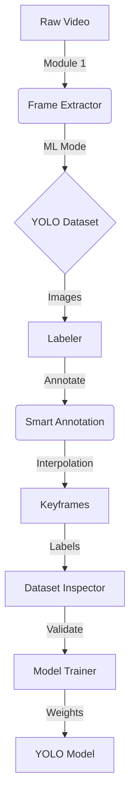

# Full Workflow Instructions (v2.0)

This guide explains how to use the **Video to ML Suite** to build a custom computer vision model. Version 2.0 introduces **Guided Mode**, which provides in-tool education and step-by-step guidance.

## 🔄 The Pipeline

---

## 🎮 Choosing Your Mode

Upon launching the **Dashboard (orchestrator.py)**, you can select your experience level:

- **Guided Mode**: Recommended for beginners. The dashboard tracks your progress, locks future steps until the current one is done, and provides a "Guided Panel" in each tool with ML education.
- **Expert Mode**: For experienced users. All tools are unlocked immediately, and the standard compact sidebars are used.

## 🌍 Language Support

You can toggle between **Greek 🇬🇷** and **English 🇬🇧** at any time using the flag icon in the top-right corner of the Dashboard. This changes all UI text, instructions, and educational content.

---

## 📍 Step 1: Frame Extraction (The Generator)

*Why you are here: Converting video into a series of images that the AI can understand.*

1.  **Select Source**: Choose your video file.
2.  **Guided Steps**: In Guided Mode, simply follow the numbered steps in the left panel.
3.  **ML Export Mode**: (Auto-enabled in Guided) This creates the `train/val` split. 80% of images are for learning, 20% for testing.
4.  **Launch**: Press **START EXTRACTION**. The engine will process the frames.

## 📍 Step 2: Smart Annotation (The Labeler)

*Why you are here: Teaching the AI what objects look like by drawing boxes.*

1.  **Open Dataset**: Select the folder created in Step 1.
2.  **Draw Boxes**: Draw rectangles around your objects.
3.  **Smart Features**:
    - **Keyframe Interpolation**: Draw a box on Frame A, move to Frame B, adjust the box, and press **I**. The tool fills all frames in between.
    - **Progress Counter**: Guided Mode shows exactly how many images you have left to label.
4.  **Save**: Labels are saved automatically as you work.

## 📍 Step 3: Dataset Inspection

*Why you are here: Checking for "health" issues like missing labels or class imbalance.*

1.  **Load YAML**: Select the `dataset.yaml` file (Guided Mode provides a path hint).
2.  **Analyze**: Look at the class distribution charts. Ensure you have enough examples for every object type.
3.  **Validate**: Fix any images flagged as "unlabeled" before moving to training.

## 📍 Step 4: Model Training

*Why you are here: The final learning phase where the AI processes your dataset.*

1.  **Select Model**: Guided Mode offers plain-language choices:
    - **Nano**: Fast, great for testing.
    - **Small/Medium**: Higher accuracy, slower training.
2.  **Epochs**: (Default: 50) One "epoch" is one full pass through your data.
3.  **Start**: Press **START TRAINING**. Monitor the **mAP** (Mean Average Precision) score — higher is better!

---

## ⌨️ Global Hotkeys (Annotator)

| Key | Action |
| --- | --- |
| **D / A** | Next / Previous Image |
| **K** | Set current frame as Keyframe |
| **I** | Run Linear Interpolation |
| **Backspace** | Delete selected box |
| **Double Click** | Rename selected object |

---
> [!TIP]
> If you have already completed a step elsewhere, use the **"I've already done this"** link in the Dashboard to unlock the next step in Guided Mode.
