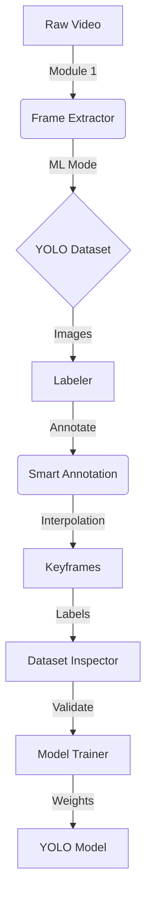

# Full Workflow Instructions

This guide explains how to use the **Video to ML Suite** to build a custom computer vision model from raw video data.

## 🔄 The Pipeline

---

## 📍 Step 1: Frame Extraction (The Generator)

The first step is to convert your video into individual images (frames).

1.  **Select Source**: Choose a single video file or a folder (Batch Mode).
2.  **ML Export Mode**: **CRITICAL** - Enable this to automatically create `train/val` folders and a `dataset.yaml`.
3.  **FPS / Trimming**: Define which part of the video you need.
4.  **Launch**: Press **START EXTRACTION**. The C++ engine will process the video and save frames to your output directory.

## 📍 Step 2: Smart Annotation (The Labeler)

Now, we need to tell the AI what it is looking at.

1.  **Open Dataset**: Select the folder created in Step 1.
2.  **Draw Boxes**: Click and drag on the image to mark objects. A popup will ask for the object name.
3.  **Keyframe Interpolation**:
    - Go to a frame where an object starts moving. Draw the box and press **K** (Set Keyframe).
    - Move several frames forward. Adjust the box to the new position and press **K** again.
    - Press **I** (Interpolate). The system will automatically calculate and draw all boxes for the frames in between.
4.  **Save**: The tool auto-saves YOLO format `.txt` files for each image.

## 📍 Step 3: Dataset Inspection

Before training, ensure your data is "healthy".

1.  **Launch Inspector**: Check for class imbalances (e.g., too many 'Cars', not enough 'Persons').
2.  **Verify**: Ensure all images have corresponding labels and that the structure is correct.

## 📍 Step 4: Model Training

The final stage where the AI learns from your data.

1.  **Select YAML**: Browse for the `dataset.yaml` file generated in Step 1.
2.  **Params**: Choose a model size (Nano is best for testing, Medium for accuracy).
3.  **Start**: Press **START TRAINING**. Monitor the console for progress (mAP, Loss).
4.  **Result**: Your trained model (`best.pt`) will be in the `runs/detect/train/weights/` folder.

---

## ⌨️ Global Hotkeys (Annotator)

| Key | Action |
| --- | --- |
| **D / A** | Next / Previous Image |
| **K** | Set current frame as Keyframe |
| **I** | Run Linear Interpolation |
| **Backspace** | Delete selected box |
| **Double Click** | Rename selected object |

---
> [!TIP]
> Always verify your `dataset.yaml` paths in System Settings if you move your project folders.
